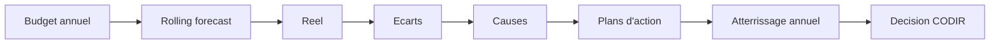

# ESN Forecast V6 - Pilotage budgetaire et trajectoire

La V6 ajoute une couche de pilotage de trajectoire au-dessus du previsionnel, du reel et du reforecast.

## Concepts metier

- **Budget** : trajectoire cible annuelle validee. Un budget approuve ou verrouille n'est pas modifie directement ; une nouvelle version est creee.
- **Budget revise** : nouvelle version de budget tenant compte d'hypotheses actualisees.
- **Forecast** : projection connue a date.
- **Reforecast** : projection recalibree apres integration du reel ou d'evenements nouveaux.
- **Rolling forecast** : forecast glissant. Les mois passes utilisent le reel, les mois futurs utilisent forecast/reforecast.
- **Actual** : reel constate.
- **Atterrissage annuel** : estimation de fin d'annee probable, calculee avec le reel a date et le forecast restant.
- **Ecart** : difference entre budget, forecast, reforecast et reel.
- **Cause d'ecart** : explication rattachee a un client, mission, facture, ressource ou transaction.
- **Plan d'action** : actions correctives rattachees a un objectif ou un ecart.
- **Pipeline necessaire** : volume commercial brut requis pour combler le gap de CA selon le taux de conversion.
- **Staffing budgetaire** : capacite necessaire pour produire le chiffre d'affaires budgete.
- **Conditions de reussite** : conditions qui doivent etre vraies pour atteindre le budget.

## Flux de pilotage

## Endpoints principaux

- `GET /api/budgets`
- `POST /api/budgets`
- `POST /api/budgets/:id/duplicate`
- `POST /api/budgets/:id/approve`
- `POST /api/budgets/:id/lock`
- `GET /api/objectives/status`
- `POST /api/rolling-forecasts/generate`
- `GET /api/annual-landing?fiscalYear=2026`
- `POST /api/variance-analyses/recalculate`
- `GET /api/action-plans`
- `GET /api/required-pipeline`
- `GET /api/budget-staffing`
- `GET /api/what-must-be-true`
- `GET /api/reports/budget-forecast-actual.json`

## Ecrans V6

- Trajectoire
- Budgets
- Detail budget
- Objectifs
- Rolling Forecast
- Atterrissage annuel
- Budget / Forecast / Actual
- Ecarts commentes
- Plans d'action
- Pipeline necessaire
- Staffing budgetaire
- Conditions de reussite

## Limites

La V6 reste un outil de pilotage budgetaire operationnel. Elle ne remplace pas une comptabilite legale, un data warehouse BI ou une planification RH complete.

