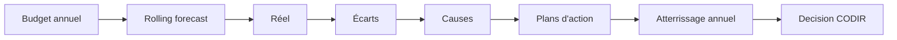

# ESN Forecast V6 - Pilotage budgétaire et trajectoire

La V6 ajoute une couche de pilotage de trajectoire au-dessus du prévisionnel, du réel et du reforecast.

## Concepts métier

- **Budget** : trajectoire cible annuelle validée. Un budget approuvé ou verrouillé n'est pas modifie directement ; une nouvelle version est créée.
- **Budget revise** : nouvelle version de budget tenant compte d'hypothèses actualisees.
- **Forecast** : projection connue à date.
- **Reforecast** : projection recalibrée après intégration du réel ou d'événements nouveaux.
- **Rolling forecast** : forecast glissant. Les mois passes utilisent le réel, les mois futurs utilisent forecast/reforecast.
- **Actual** : réel constaté.
- **Atterrissage annuel** : estimation de fin d'année probable, calculée avec le réel à date et le forecast restant.
- **Écart** : difference entre budget, forecast, reforecast et réel.
- **Cause d?Écart** : explication rattachée à un client, mission, facture, ressource ou transaction.
- **Plan d'action** : actions correctives rattachées à un objectif ou un Écart.
- **Pipeline nécessaire** : volume commercial brut requis pour combler le gap de CA selon le taux de conversion.
- **Staffing budgétaire** : capacit? nécessaire pour produire le chiffre d'affaires budgété.
- **Conditions de réussite** : conditions qui doivent être vraies pour atteindre le budget.

## Flux de pilotage

## Endpoints principaux

- `GET /api/budgets`
- `POST /api/budgets`
- `POST /api/budgets/:id/duplicate`
- `POST /api/budgets/:id/approve`
- `POST /api/budgets/:id/lock`
- `GET /api/objectives/status`
- `POST /api/rolling-forecasts/generate`
- `GET /api/annual-landing?fiscalYear=2026`
- `POST /api/variance-analyses/recalculate`
- `GET /api/action-plans`
- `GET /api/required-pipeline`
- `GET /api/budget-staffing`
- `GET /api/what-must-be-true`
- `GET /api/reports/budget-forecast-actual.json`

## Écrans V6

- Trajectoire
- Budgets
- Détail budget
- Objectifs
- Rolling Forecast
- Atterrissage annuel
- Budget / Forecast / Actual
- Écarts commentés
- Plans d'action
- Pipeline nécessaire
- Staffing budgétaire
- Conditions de réussite

## Limites

La V6 reste un outil de pilotage budgétaire opérationnel. Elle ne remplace pas une comptabilite legale, un data warehouse BI ou une planification RH complète.

